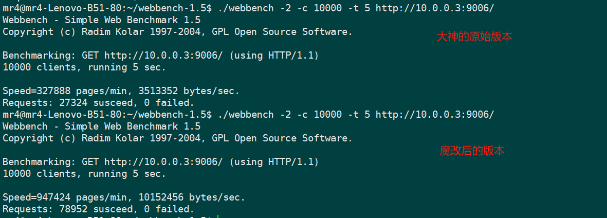

### 魔改版webServer

#### 环境和参数配置

```sql
// 建立webServer库
create database webServer;

// 创建user表
USE yourdb;
CREATE TABLE user(
    username char(50) NULL,
    passwd char(50) NULL
)ENGINE=InnoDB;

// 添加数据
INSERT INTO user(username, passwd) VALUES('name', 'passwd');
```

配置json环境
```shell
git clone git@github.com:open-source-parsers/jsoncpp.git
cd jsoncpp
python amalgamate.py
cp dist/ webServerPro/ -r
```

修改configFile.json中的配置参数
```json
{
   "CONNTrigmode" : 0,          //连接套接字的触发模式
   "LISTENTrigmode" : 0,        //监听套接字的触发模式
   "LOGWrite" : 0,              //日志同/异步
   "OPT_LINGER" : 0,            //优雅关闭
   "PORT" : 9006,               //监听端口
   "TRIGMode" : 0,              /*listenfd和connfd的模式组合，默认使用LT + LT
                                    0，表示使用LT + LT
                                    1，表示使用LT + ET
                                    2，表示使用ET + LT
                                    3，表示使用ET + ET*/
   "actor_model" : 0,           //事件处理模式
   "close_log" : 0,             //是否关闭日志
   "databasename" : "webServer",//数据库名字
   "passwd" : "**",             //密码
   "sql_num" : 8,               //sql连接池的连接数
   "thread_num" : 8,            //线程池的线程数
   "user" : "root"              //数据库登录的密码
}
```

启动项目
```shell
make -j8
./server configFile.json
```


#### 根据大神的TinyWebServer进行改进的版本

改进内容主要如下

1. 使用c++11标准线程库替换linux系统接口，比如thread、mutex和condition_variable;
2. 利用智能指针管理裸指针，解决了一些内存泄露隐患，比如shared_ptr管理内存映射;
3. 定时器增加了时间片轮询和时间堆两种定时器的实现;
4. 引入了高性能的线程安全哈希表，精细化锁粒度，对不同的hash桶进行上锁;
5. 实现LFU缓存，实现对文件内存映射的缓存，提高文件访问速度;
6. 参考STL容器的内存管理，实现了一个内存池，用在定时器和LFU缓存中的内存申请，减少因频繁申请、释放内存而产生内存碎片;
7. 改进了日志类，根据muduo高性能网络库对本项目的日志类进行改进，改成双缓冲日志库，大大的提升了性能。


下面是通过webbench在本地进行的压测，可以看出性能提升了很多，本地电脑是7年前的破电脑了，只能用来对比，不能看数据



本项目在使用双缓冲日志库之前，还使用过log4cplus日志库，性能提升不如现在版本的双缓冲日志类


收获：

预期叫收获不如叫踩坑记，这个项目虽然不是自己从0到1写的，但是做这个项目的时候，自己写的时候也没有照抄，自己用自己的代码写的，当时写的时候就想着，尽量使用cpp的手法写，因此基本上把c风格字符串改为了string，并将http头解析部分使用了正则表达式，然后使用了cpp线程库的套件实现锁、信号量和条件变量，来实现线程池和阻塞队列。  然后发现有大问题，完全是反向优化了，吞吐量直接差一个数量级。我就开始分析自己的代码，画出火焰图分析性能瓶颈，首先就是正则表达式那火焰图都变成一块了，太耗资源了，把正则表达式改来，换成了普通字符串处理。


最终通过自己一点点的优化性能，也就是上述的改进，照原始版本提升了很多。项目收尾